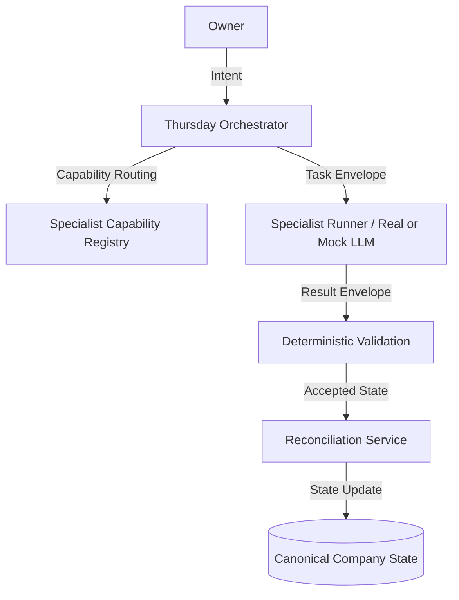

# Thursday V2-D Control Plane Architecture

This document describes the design and components of the **Thursday V2-D Specialist Agent Operating System & Control Plane**.

## 1. Core Orchestrator
The `CompanyOrchestrator` in [`thursday/agent_orchestrator.py`](file:///Volumes/Jack_Gandy_1TB_SSD/Audio_Engineering_Company/Audio_Too/thursday/agent_orchestrator.py) is the central dispatcher. It decomposes broad user requests into individual tasks, coordinates executing nodes, tracks dependencies using a Directed Acyclic Graph (DAG), and manages resource scheduling.

## 2. Capability-Based Routing
The `SpecialistRegistry` registers node capabilities and manifests. Tasks are routed deterministically via keywords (e.g. "regression test" -> QA) and fall back to general capabilities, avoiding random swarming.

## 3. Resource Scheduling
A strict concurrency budget blocks launching heavy C++ builds or deep ML jobs concurrently:
- Heavy Tasks: Max 2
- Medium Tasks: Max 3
- Light Tasks: Max 10

## 4. Reconciliation and Invalidation
Outputs of specialist tasks do not directly override company memory. They undergo strict validation and conflict checks (QA failure overrides engineering success) before updates are committed.
