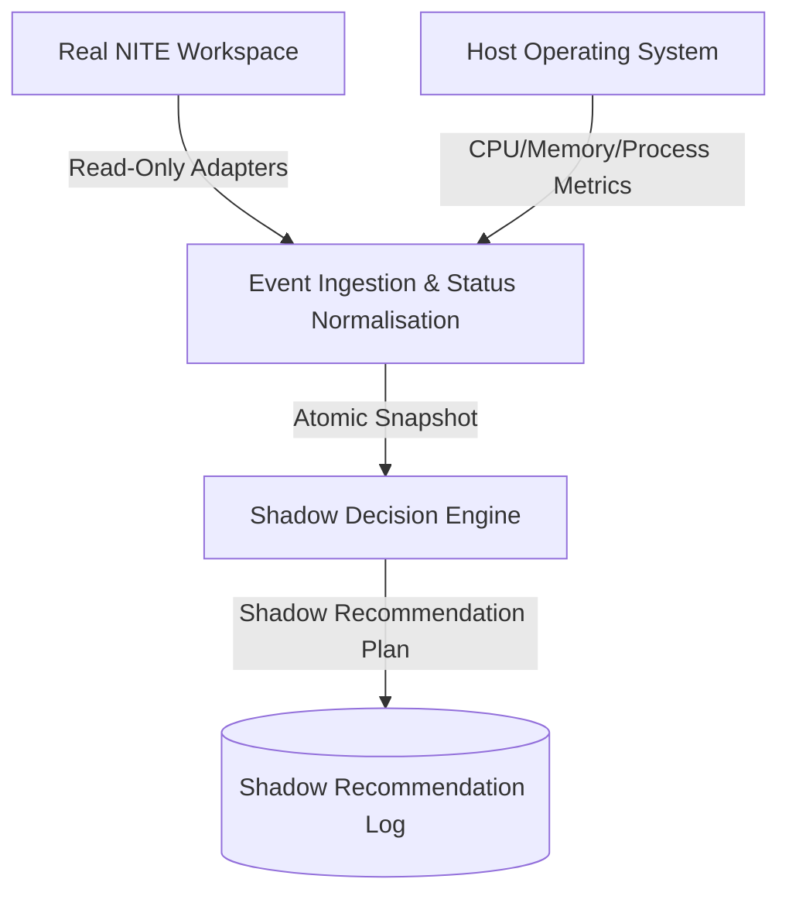

# Thursday V2-E Live Shadow Mode Architecture

This document describes the read-only operational mapping and monitoring pipeline introduced in V2-E.

## 1. Event Ingestion Pipeline
Adapters in `thursday/shadow_adapters.py` continuously read logs, git status, and process IDs from the parallel workspaces (`SmartSampleManager`, `SLO_V5C`, etc.) on the host system.

## 2. Status Normalisation and Freshness
Outputs are mapped to standard states (e.g. `OWNER_ACTION_REQUIRED`, `INTEGRATION_READY`) and bound with freshness classes (`FRESH`, `AGING`, `STALE`) to ensure Monday's qualifications are never used to authorize Friday's merges.

## 3. Shadow Decisions and Stall Detection
The `ShadowPlanner` calculates the next safe steps and formats them as `ShadowRecommendation` logs under the strict constraint `execution_enabled = False`. It automatically checks log write heartbeats against active PID status to discover stalls.
