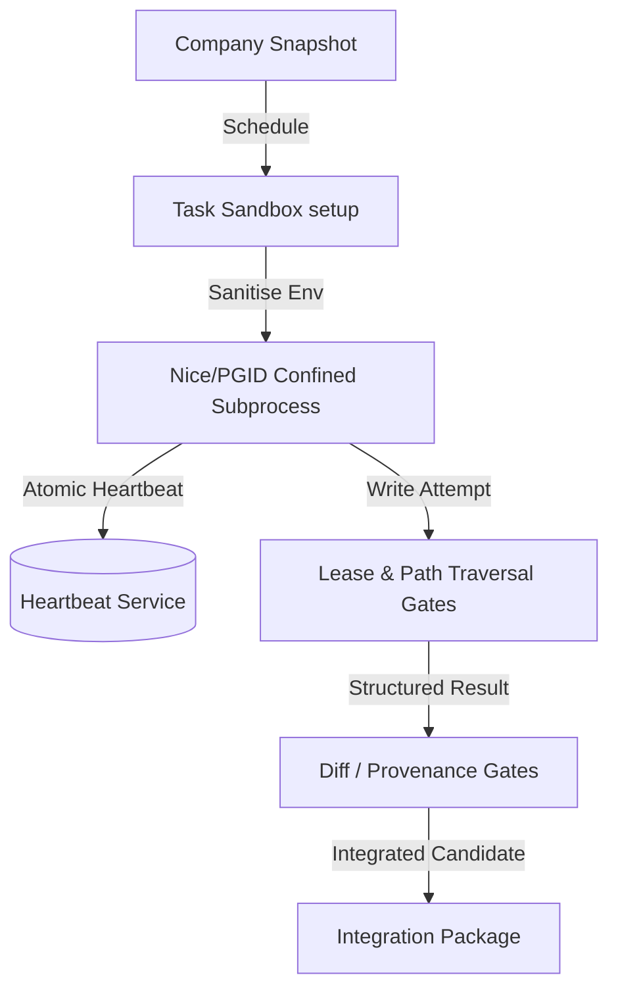

# Thursday V2-F Isolated Specialist Execution Architecture

This document describes the task sandboxing, process confinement, and validation mechanics qualified in V2-F.

## 1. Task Confinement Sandbox
The `TaskSandbox` in [`thursday/sandbox.py`](file:///Volumes/Jack_Gandy_1TB_SSD/Audio_Engineering_Company/Audio_Too/thursday/sandbox.py) sets up isolated workspace directories and dedicated Git worktrees. It runs processes in a pruned environment, stripping secret environment keys and scoping the `HOME` variable to the temporary sandbox folder.

## 2. Process Containment
All child processes are launched under unique Process Group IDs (PGID) and nice priority levels. This ensures that Thursday's automated cleanup signals target only the subprocess trees of the corresponding task, preventing leaks or interference with foreign processes.

## 3. Integration Candidate Packaging
Accepted task outputs are assembled into `IntegrationPackage` files containing diff summaries, candidate branch details, and testing logs, ready for review or manual integration.
