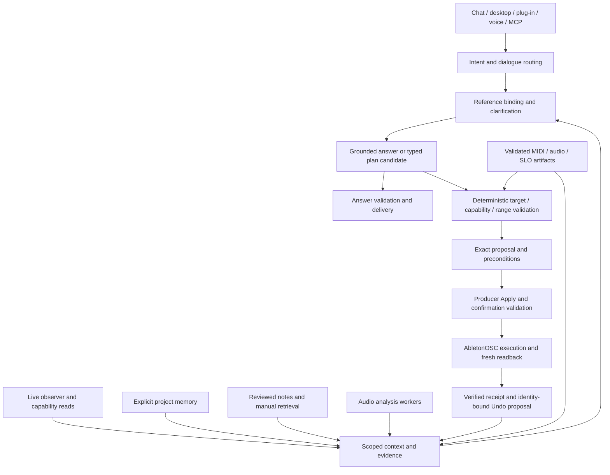

# KENN plan

Updated 2 October 2026. This is KENN's sole product roadmap, architecture direction,
work queue and progress checklist. Start here, then read the named source, tests and
evidence for the task. `AGENTS.md` governs repository work. Dated reports describe
their recorded commit and environment; they do not authorize work or prove today's
build. Component specifications and runbooks explain contracts and procedures.

The previous North Star, mega plan, beta plans, trackers and execution prompts are
retired. Their history remains in Git; the consolidation record is
[the planning audit](docs/evidence/KENN_PLANNING_CONSOLIDATION_2026-10-02.md).
Update this file instead of creating another roadmap, handoff prompt or progress log.

The [2 October product and open-source research](docs/research/KENN_PRODUCT_AND_OPEN_SOURCE_RESEARCH_2026-10-02.md)
informs C1–C2, L2–L3 and B1–B4 below. Its three experiment protocols supply candidate
methods for local delivery, passage reranking and audio measurements; their proposed
thresholds do not replace this plan's acceptance targets. Product references inform
interface choices; new dependencies and model assets still require approval.

## Purpose and decisions

KENN is a local language-model assistant for a producer using Ableton Live. It should
understand ordinary requests and follow-ups, explain music and audio clearly, use
current session facts, and prepare useful changes that the producer can inspect,
Apply and Undo. Fast deterministic commands and grounded conversation both matter.

The owner's current priority is useful conversation, efficient local inference and
good Ableton integration. Large citation-capture projects, source-count targets and
new control families do not take precedence over that work. Grounding remains a
product requirement: unsupported measurements, sources and claims must be rejected.

Decisions already made:

- Local Qwen3 8B chat (`kenn-brain-qwen3-8b`) and Qwen3 4B planner. Keep this model
  choice; investigate pipeline costs before proposing another model. No hosted brain.
- The Mac target is Apple M3 with 16 GB unified memory. Model residency, context and
  concurrency must fit alongside Live. Do not assume both models can stay resident
  without measuring memory pressure and model switching.
- Python owns dialogue, retrieval, memory, policy and jobs. C++ owns measured DSP
  kernels and plug-in realtime work. A whole-backend rewrite is outside this plan.
- AbletonOSC is the Live transport owner. UI, HTTP, voice and MCP must share the
  same typed policy and execution services, without a second write authority.
- Preferences require explicit opt-in. Session inference, diagnostic hypotheses
  and a producer's saved preferences are different kinds of information.
- Engineering runs against `FakeLiveBackend`, mocks and synthetic fixtures. Real
  Live writes require an owner-scheduled, supervised qualification on a disposable
  set. Existing real-Live receipts qualify their recorded scope, not every new build.

## Architecture

This is the intended dependency direction. Existing code already implements much
of it; the audit below identifies where consistency still needs proof. It is not
an instruction to add a new framework or duplicate the current services.



There are two loops. The reasoning loop may read, retrieve, analyse and propose.
The action loop validates, confirms, executes, reads back and records. A fluent
answer, retrieved note, audio finding or model plan cannot grant write permission.

| Responsibility | Existing implementation | Boundary to preserve or qualify |
|---|---|---|
| Request routing and answer delivery | [chat facade](apps/backend/src/kenn/core/chat.py), [routing](apps/backend/src/kenn/core/chat_routing.py), [Live router](apps/backend/src/kenn/core/chat_live_router.py), [answers](apps/backend/src/kenn/core/chat_answer.py) | Route once; ask one useful clarification; align streaming, foreground and background validation. Short commands must not wait for knowledge generation. |
| Model transport and generation | [LLM transport](apps/backend/src/kenn/llm/llm_rewrite.py), [background upgrades](apps/backend/src/kenn/core/answer_upgrades.py) | Qwen calls use the native Ollama path with thinking off unless explicitly configured otherwise. Bound output, timeout, workers and memory; count every attempt and fallback. |
| Retrieval and answer verification | [retrieval](apps/backend/src/kenn/retrieval/retrieval.py), [chat retrieval](apps/backend/src/kenn/core/chat_retrieval.py), [grounding](apps/backend/src/kenn/core/chat_grounding.py) | Evidence must support the claim and units. A user's question and an answer's own source list are not evidence. Keep index/model/prompt provenance. |
| Dialogue references and project facts | [session context](apps/backend/src/kenn/core/session_context.py), [Live world model](apps/backend/src/kenn/core/live_world_model.py), [session world model](apps/backend/src/kenn/core/session_world_model.py) | Separate current observations, conversation slots and durable preferences. Reuse existing owners; audit overlapping state before consolidating it. |
| Command interpretation | [Live command gateway](apps/backend/src/kenn/core/live_command.py), [rule parser](apps/backend/src/kenn/core/live_intent.py), [ordered rule stages](apps/backend/src/kenn/core/live_intent_rules) | Deterministic refusals and target binding remain authoritative. A planner supplies candidates; ambiguous or stale identities require clarification. |
| Proposal, Apply, readback and Undo | [action service](apps/backend/src/kenn/core/live_action_service.py), [backend interface](apps/backend/src/kenn/core/live_backend.py), [recipes](apps/backend/src/kenn/core/live_recipe.py) | Every enabled write needs exact identity, value/unit, preconditions, expiry, confirmation, verified outcome and a stated recovery path. |
| Multi-step tasks and MCP | [coordinator](apps/backend/src/kenn/core/assistant_coordinator.py), [MCP handlers](apps/backend/src/kenn/core/mcp) | Stop on stale state, partial failure or cancellation. No raw OSC, arbitrary execution or policy bypass through a different surface. |
| Explicit memory | [profile memory](apps/backend/src/kenn/core/assistant_profile_memory.py), [project advisory](apps/backend/src/kenn/core/project_memory_advisory.py) | Scope by project/session, expose active and superseded values, support edit/delete/restore, and identify memory when used in an answer. |
| Listening and creation | [analysis](apps/backend/src/kenn/core/audio_analysis.py), [local Mix Review](apps/backend/src/kenn/core/local_mix_review_service.py), [MIDI artifacts](apps/backend/src/kenn/core/audiogen_artifacts.py) | Measured findings, interpretation and proposed fixes stay distinct. An uploaded bounce does not identify a Live target. Generated artifacts require validation and preview before a proposal. |
| Realtime plug-in | [JUCE plug-in](plugins/kenn-vst3-au) | No model, network, filesystem work, blocking lock or allocation in the audio callback. Communicate with companion workers asynchronously. |

### Context and identity contract

Every fact needs its origin and scope: Live observation, manual/note excerpt,
measured audio, generated artifact or explicit preference. Include time/version,
applicability and uncertainty. A stale observation remains stale; a predicted track
role remains a hypothesis. Conflicting evidence is surfaced rather than silently
merged. Prefer relevant official documentation and measured device data over advice;
validate the current implementation of source tiers rather than assume this policy
is fully qualified.

Current target identity uses indexes, names, display positions and snapshot
preconditions; stable host object IDs and a persistent revisioned project graph are
not fully established. Never treat a name or numeric position as durable identity.
Bind to the current snapshot, re-read affected objects before Apply, and reject a
renamed, reordered, removed or multiply matching target. Stable IDs may be adopted
only where the transport exposes and qualifies them; do not manufacture persistence
by attaching an ID to a name.

Cache keys must cover session/project, relevant state, index/model/prompt versions
and the evidence used. Semantic similarity is not exact identity. Never reuse a
cached observation as an Apply precondition. Background answers must carry the same
context scope as foreground answers, and an old job must not replace a newer turn.

### Action and failure contract

A proposal records typed operations, target identities, exact before/after values,
units/ranges, preconditions, expiry and verification predicates. Confirmation is
bound to that proposal and session. No model can create an approval token.

Writes to one Live set must be serialized and idempotency-bound; audit all routes
before claiming this is consistently implemented. Re-read before execution and
read back after it. A timeout can mean the write landed: report an unknown outcome,
inspect state, and never blindly retry. Receipts distinguish requested, attempted,
applied and verified work, including partial batches. Undo uses observed before-state
and refuses an identity mismatch or an independently changed post-state. Do not claim
atomic rollback for an operation whose backend cannot prove it.

Process restart expires in-memory confirmations. Cancellation prevents future
steps; it does not erase an already applied change. Unsupported or non-reversible
operations must state that limitation before Apply. Keep auto mode disabled.

### Performance contract

Keep deterministic command parsing, Live reads and the first useful grounded answer
responsive while a single background answer is generated. The existing upgrade
worker permits one generation at a time and retains at most 50 results for 600 s;
that bound is not proof of per-session ownership, cancellation or fair scheduling.
Audit those properties before adding another job abstraction.

Measure routing, reference binding, query embedding, retrieval, prompt construction,
model prefill, decode, validation, OSC, readback and analysis separately, plus the
complete request. Report TTFT, first useful answer and accepted final answer as
different measures. Include queue time, cache state, model digest, output tokens,
memory pressure and cold/warm residency. Rejected answers and busy attempts count.
Optimize the dominant measured cost one change at a time.

CPU ONNX query embeddings are the current choice. Native DSP remains opt-in pending
rights-cleared and cross-platform release evidence. Historical spectral-only and
later decoder/bulk-metrics results have different scopes; use the exact workload and
receipt in [native qualification](docs/research/CPP_DSP_PHASE4_RELEASE_QUALIFICATION.md).
Component design references are [DSP architecture](docs/research/CPP_DSP_TARGET_ARCHITECTURE.md)
and [shared runtime boundaries](docs/research/CPP_SHARED_RUNTIME_ARCHITECTURE.md).
Kernel timing alone cannot justify changing the default or sharing an ABI.

## Verified starting point

The source baseline for this consolidation is `153f06cb`. These ticks apply only
to the stated implementation and evidence; they do not imply release qualification.

- [x] **V1 — Query embedding overhead reduced.** Same fp32 model and index, CPU ONNX
  1.14–1.15 ms p50 versus CoreML 12.43–12.72 ms in two 40-query runs; identical
  ordered top-four results on 240 questions. [Evidence](docs/evidence/KENN_QUERY_EMBEDDING_LATENCY_2026-10-02.md).
- [x] **V2 — Displayed track choices retain the unfinished request.** Exactly two
  fresh choices support “the other one” after selecting one, including after Apply.
  The 300 s window, identity checks, ambiguous model refusal and session isolation
  have 20 tests and seven caught mutations. [Evidence](docs/evidence/KENN_TRACK_CHOICES_2026-10-02.md).
- [x] **V3 — Query-echo sections filtered before candidate limits.** Implemented in
  `f0ebeba6`; regression tests cover Related-questions chunks. This does not certify
  an index rebuild or a new retrieval-quality result.
- [x] **V4 — Preference history and restore implemented.** Existing API/service and
  tests cover superseded values, transactional restore and session boundaries.
  Human UI qualification remains open.
- [x] **V5 — Source excerpt boundary fixes implemented.** Existing
  `test_source_excerpt_boundaries.py` covers word, fence and tag truncation. Retired
  unchecked boxes for this fix and preference history were stale.
- [x] **V6 — Existing monthly reporting and release qualifier identified.** Preserve
  their measurements and gate semantics; update their document paths during cleanup.

The last full backend run at V2: **3,109 passed, 12 skipped, one known failure** in
76.42 s. `test_live_command::test_llm_plan_gets_one_structural_repair_attempt` is
order-dependent and passes alone. A5 later traced that failure to collection-time
environment contamination and fixed it: the combined 2 October run passed
**3,171 tests, with 12 optional-dependency skips and no failures**, in 98.40 s.
[Current baseline and scope](docs/evidence/KENN_TEST_BASELINE_2026-10-02.md).

Model acceptance was 22/29 and 23/29 in two earlier runs recorded by the incoming
handoff. That sample is too small to establish 90%; latency also varied. Its TTFT
sample was 3.18 s median / 5.04 s p95. These are historical observations, not a
post-embedding baseline. Earlier 4090 results met a timing threshold while landing
13/30 answers: **43% does not meet a 70% acceptance requirement**. Re-measure the
current local paths before making a new claim.

## Work sequence and checkboxes

One sequence replaces the old concurrent tracks and dated week estimates. Finish
the active step's bounded slice before adding work. Real-Live or human-review gates
can stay open while independent engineering continues; they cannot be ticked by a
mock, an agent reviewer or an unrelated receipt.

### 1. Consolidate planning and audit architecture

- [x] **A1 — Consolidate navigation.** Retired 45 competing or superseded files,
  preserved evidence and recovery procedures, repaired active references and release
  artifact checks. 57 introduced local links resolve; 64 scoped tests pass and both
  missing-document checks fail as required. [Audit and exact files](docs/evidence/KENN_PLANNING_CONSOLIDATION_2026-10-02.md).
- [ ] **A2 — Trace every request and write route.** Inventory UI/HTTP/stream/background/
  voice/MCP entry points through routing, context, proposal, Apply, readback and Undo.
  Compare function/registry bindings, not names alone. Record each bypass or duplicate
  owner with a source symbol and reproducible fixture. Do not refactor while auditing.
- [ ] **A3 — Resolve scoped delivery defects first.** Audit memory/cache isolation,
  project switching, upgrade polling ownership, stale-turn replacement and
  cancellation; fix verified defects with cross-session and late-job tests.
  Preserve the rule against recording the question twice.
  - [x] Main HTTP/UI background path retains session/plugin/correlation identifiers,
    reads project preferences without a second memory/cache write, scopes polling
    to the originating chat and discards superseded or cleared results. 48 scoped
    backend and 20 frontend tests pass; 15 mutations are caught. [Evidence and exact files](docs/evidence/KENN_BACKGROUND_CONTEXT_2026-10-02.md).
  - [x] FastAPI ask uses the actual public answer signature, retains session/plugin/
    correlation identifiers and handles nullable optional context. Ask and clear
    discard that chat's older background result; other chats remain intact. 49 scoped
    tests pass; 10 mutations are caught. [Evidence and exact files](docs/evidence/KENN_FASTAPI_CONTEXT_2026-10-02.md).
  - [x] MCP knowledge and both public knowledge wrappers use request-local retrieval
    policy without replacing shared engine functions. Knowledge preserves scoped
    preferences and typed review context without creating transport proposals or
    another chat turn. 218 scoped backend and 100 wrapper tests pass; 25 mutations
    are caught. [Evidence and exact files](docs/evidence/KENN_KNOWLEDGE_POLICY_2026-10-02.md).
  - [ ] Trace other request owners, cache invalidation after preference/Live changes,
    project switching and Apply/Undo during generation. Discarding delivery keeps
    the model slot occupied until inference finishes; actual inference cancellation
    remains unqualified. Public wrapper import-time model/index mutations remain open.
- [ ] **A4 — Replace unconditional status claims with observed status.** Audit
  `chat_answer._short_circuit_evaluator`, including its MLX/OSC status text and cancel
  reply, against actual selected inference backend, connection and pending actions.
  Transport branches propose through the action service; trace their validation path
  before changing or describing them as a bypass.
- [x] **A5 — Establish the clean test baseline.** Scoped collection-time model policy
  to individual tests and the offline replay CLI without changing planner assertions
  or production enablement precedence. Eight import and four CLI guards pass; seven
  mutations are caught. Full backend: 3,171 passed, 12 optional-dependency skips,
  no failures in 98.40 s. [Evidence and exact files](docs/evidence/KENN_TEST_BASELINE_2026-10-02.md).

**Next executable task: continue A2/A3 through the remaining bound request owners.**
Do not resume citation capture, a speculative rewrite or an unfinished extraction
merely because an old document suggested it.

### 2. Qualify useful local conversation and performance

Needs the route/context audit; fixes may land in small slices while that audit continues.

- [ ] **C1 — Current-path baseline.** At least 30 knowledge questions on M3/16 GB,
  separate streaming, foreground and background runs, both caches declared, exact
  model/index/code versions. Capture each stage and rejection reason. Repeat comparable
  runs; keep TTFT separate from completion time. Compare Live-open/closed only under
  controlled owner-supervised conditions, without writing to Live.
  Include admission/queue, context/retrieval, prefill, generation, verification,
  polling and displayed-result timing. Declare model-cold/warm conditions and record
  combined memory pressure, swap and audio dropouts at a fixed Live buffer/session.
- [ ] **C2 — Remove measured wasted work.** Review serial model calls, critique of a
  deterministic fallback, repeated retrieval, prompt/output budgets and residency.
  Native Ollama thinking-off behavior and the general 384-token output cap already
  exist; verify the selected model digest and actual response path before blaming
  hardware. Any MLX comparison must explicitly use the chosen Qwen3 8B lineage,
  rather than the engine's smaller default. Require unchanged safety and a held-out
  quality comparison for each latency change.
- [ ] **C3 — Five-turn conversation qualification.** Model in the loop: anaphora,
  corrections, two-track choices, changing topics, partial requests, failed jobs,
  cancel/restart and project switching. Read-only answers remain distinct from proposed
  actions; only explicit Apply produces an execution receipt. Include the UI delivery path.
- [ ] **C4 — Independent language and answer qualification.** Keep tuning, sealed and
  human-reviewed sets separate. Publish per-family correct/clarify/wrong results and
  all attempted/accepted/rejected/busy counts. No regenerated expectations that bless
  a new implementation's mistakes; no tuning on sealed cases.
- [ ] **C5 — Reach the quality and timing targets below.** Improve evidence selection
  and useful answers without lowering grounding thresholds. The fixed local model is
  a constraint to measure against, not a reason to label a missed target as passed.

### 3. Qualify Ableton knowledge and existing control breadth

Needs C3's dialogue contract. Improve concrete failed journeys before adding families.

- [ ] **L1 — Device capability coverage.** Inventory all 78 target devices against
  the installed Live version. Distinguish manual-described, observed, measured,
  fake-tested and real-Live-qualified parameters. First milestone: at least 25 devices
  and 60 parameters qualified end to end; then close remaining coverage explicitly.
  Qualify nested rack-chain and return/master device targets, complete range and
  enabled/state/automation metadata, chooser labels and display-unit parity. Treat
  the 78 stock entries as a baseline; separately inventory Packs, presets, Max for
  Live and plug-ins, recording unsupported or manual-only controls explicitly.
- [x] **L1a — Audit whole-software Live 12 coverage.** Completed 2 October 2026:
  chat, planner, HTTP, MCP, frontend, native plug-in, desktop, backend and bundled
  Remote Script reviewed against installed Live 12.4.6 and official references.
  Three independent agent reviews confirmed the source/offline findings; the
  [report](docs/evidence/KENN_LIVE12_IMPLEMENTATION_AUDIT_2026-10-02.md) and
  [JSON evidence](docs/evidence/KENN_LIVE12_IMPLEMENTATION_AUDIT_2026-10-02.json)
  record the 78-device matrix and verification limits. Full control is not proved;
  repairs remain in L1/L5 and real-Live qualification remains open.
- [ ] **L2 — Retrieval and knowledge.** Authorized Live 11 manual material already
  exists in the local index; it does not prove Live 12 parameter accuracy. Add only
  reviewed, version-applicable missing facts and craft notes tied to failed questions.
  Audit fixture exclusions (including substring matching) and source tiers before
  claiming improved recall. Any authorized rebuild is a candidate on GPU 0/1 with
  parity, digest, recall and rollback evidence; never rebuild on this Mac.
  If a demonstrated passage-relevance gap remains, compare a small CPU ONNX
  cross-encoder on the same top 12–20 candidates with current retrieval. Use research
  experiment 2's quality, latency and memory screens; retain version/unit constraints
  and grounding. Reranking alone does not require an index rebuild or a new database.
- [ ] **L3 — Qualify existing recipes.** At least 15 recipes, fake first, then an
  owner-scheduled disposable-set run: exact target/value, Apply/readback, partial
  failure, stop/cancel and verified Undo. The recipe card and its component test
  already exist; audit usability rather than schedule their creation again.
  Test whether producers can inspect current/proposed values, units and targets,
  edit the suggestion and understand partial-change receipts before expanding recipes.
- [ ] **L4 — Planner shadow qualification.** Keep deterministic authority. Promotion
  requires the existing comparison/time/schema/agreement gates and human review;
  include ambiguity, missing ranges, wrong units and stale identities. A large
  synthetic corpus or high schema validity alone does not qualify action accuracy.
- [ ] **L5 — Confirm transport reliability across surfaces.** Fresh preconditions,
  ordered/duplicate/missing OSC replies, reconnect, idempotency, per-set serialization,
  ambiguous timeout outcomes, restart and identity-bound Undo. Use the A2 route map
  to demonstrate that no frontend or MCP entry point has independent write authority.
  Close L1a's 12 missing declared writes and four reads through implemented handler
  contracts or explicit refusal, with compound OSC payload encoding and feature
  negotiation. Bind complete automation curves to confirmation; replace sent-only
  verified receipts with observed readback and reject partial parameter metadata.
  Test typed MCP proposals through the actual HTTP gateway and validate native
  Apply/Undo outcomes and receipts before displaying success. Resolve the unused
  planner dB conversion path; keep direct C++ writes off pending parity qualification.

### 4. Qualify listening, memory and creation

Listening and memory read-only work may proceed once scoped context is proved.
Creation that writes to Live depends on L3/L5; it does not delay the core assistant.

- [ ] **B1 — Listening usefulness.** Consented mix evaluation with two independent
  human reviewers; keep clipping/headroom/L-R findings and broader unqualified
  interpretations distinct. A finding offers a change only with a separately bound
  Live target, and re-measurement reports what changed rather than promising quality.
  Remove synthetic production evidence from the empty-input reference matcher and
  its HTTP/tool callers: absent or empty spectra produce an unavailable result, with
  no measured finding or EQ recipe. Qualify loudness windows/gating, LRA and true peak
  against permitted conformance vectors and controlled fixtures. A pinned libebur128
  comparison is optional and needs approval; agreement alone is not conformance.
- [ ] **B2 — Memory usability.** Testers can inspect, edit, delete and restore saved
  preferences; answers identify memory used; a different project/session cannot read
  it. Explicit saves only. Verify reset/export/retention behavior and UI/API parity.
- [ ] **B3 — MIDI creation.** Validate bounded, hashed, labelled artifacts; preview
  musical metadata; select an exact target; propose insertion; verify Apply and Undo.
  Owner listening review is required for usefulness claims. Existing artifact/import
  code is a starting point, not a completed creation gate.
- [ ] **B4 — Optional integrations.** Audio-to-MIDI, reference suggestions, AudioGen,
  SLO and offline AutoMix remain separate typed artifact providers with unavailable
  states. Audio generation needs explicit opt-in and license/provider review; no
  silent network provider, filesystem rename or automatic session modification.
  Reference A/B should use authorized files, corresponding sections and matched
  playback loudness; identify analysed regions and normalization separately. For
  later provider trials, investigate local whisper.cpp push-to-talk or Basic Pitch
  ONNX on bounded instrument clips, one at a time. Speech becomes inspectable text
  through the existing policy; MIDI keeps preview/target/Apply/Undo. Pin code and
  weight licences separately and qualify offline operation and resource use.

### 5. Qualify and release one exact build

- [ ] **R1 — Reproducible source and package.** Clean checkout on the supported matrix,
  backend/frontend/native/plugin checks, approved local assets declared separately,
  source/index/model/build digests and distribution rollback. Historical clean builds
  do not prove this commit. Do not change dependencies or CI without approval.
- [ ] **R2 — Human and real-session evidence.** Two independent reviews/adjudication,
  consented real mixes, at least 10 supervised sessions across three projects, and
  an eight-hour reconnect-aware soak for the candidate build. Record unauthorized
  writes and exact Undo outcomes. Owner scheduling is required for Live mutations.
- [ ] **R3 — Distribution and support.** Signing/notarization/clean-host AU and VST3
  validation, clean-account setup under 15 minutes, supported matrix, feedback channel,
  privacy-preserving diagnostics, tester sign-off and exercised rollback. Do not invite
  testers or publish from a historical “ready” assertion.
- [ ] **R4 — Run the existing release qualifier.** Evaluate all 15 named checks at the
  exact release source and artifacts; preserve profile-specific requirements. Required
  failed, pending or unmeasured gates prevent a qualified release. Optional current-Live
  probing is not a substitute for captured qualification evidence.

## Acceptance targets and measurement rules

These carry the North Star's useful targets forward. They are open unless a named
receipt proves the same definition, corpus, build and environment. Never combine
different hardware, routes or fixtures into a single passing figure.

| Measure | Target and denominator |
|---|---|
| Natural requests | At least 95% correct on at least 500 fresh blind phrasings from at least three authors; two human reviewers; zero wrong actionable plans. Clarifications are reported separately. The tuned 505-row set is regression evidence. |
| Chat usefulness and acceptance | At least 90% accepted useful, supported model answers on an independent set large enough to report uncertainty; at least 150 cases for the initial qualification. Also preserve the sealed chat correctness target of at least 95%. Acceptance alone cannot establish truth. |
| Local model delivery | At least 70% of eligible knowledge requests deliver an accepted model answer within 15 s on M3/16 GB with Live open. Count rejected, timed-out and busy requests in eligible requests; separately report attempted-only acceptance. |
| Responsiveness | Clear deterministic command proposals: p95 at most 500 ms as the improvement target. Preserve the existing 700 ms controller qualification budget until a same-scope run proves the stricter target. First useful answer p95 at most 4 s; model-final p95 at most 4 s remains a longer-term performance target, separate from the local 15 s/70% gate. |
| Retrieval and factual accuracy | Recall@4 at least 0.95 on at least 300 independently reviewed questions and at least 0.80 on the sealed set; parameter quiz at least 90%; audit 100 answers for unsupported claims and source applicability. Report abstentions, exclusions and fixture-level scores. |
| Live control | Zero unauthorized writes; 100% verified exact Undo for qualified reversible operations. At least 25 devices/60 parameters first, then all 78 target devices with explicit unsupported entries. |
| Recipes | At least 15 real-Live-qualified recipes; p95 per-step at most 3 s; exact Undo; at least three supervised testers and zero unauthorized writes. Fake receipts do not close this gate. |
| Planner promotion | At least 500 comparisons over at least 14 days, at least 98% schema validity, at least 90% deterministic agreement, no increased wrong plans or safety failures, and human review under `live_llm_promotion.py`. |
| Listening | At least 80% reviewer agreement on useful findings and at least 90% applied-fix remeasurement success on the consented qualified corpus; two reviewers. No unsupported musical-quality claims. |
| Memory and creation | Human memory find/delete/isolation checks; explicit consent and provenance; owner listening review for generated ideas; every enabled insertion has verified Undo or is withheld. |

Report monthly with [monthly measures](tooling/scripts/monthly_measures.py):
understanding by family; answer quality and abstention; retrieval by fixture;
TTFT/first/final answer and stage p50/p95; attempted and delivered model answers;
grounding rejections by reason; answers without supporting sources; unauthorized
writes; verified Undo; recipe/device coverage; memory leaks and job outcomes.
The reporter retains historical North Star comparison labels; those are dated
baselines, not current gates. Missing assets or stage logs mean **not measured**.

The release checker is [qualify_internal_beta.py](tooling/scripts/qualify_internal_beta.py).
Its checks are `artifacts`, `real_live`, `support_matrix`, `human_review`,
`source_snapshot`, `plugin_distribution`, `automated_suite`, `intelligence`,
`planner_bakeoff`, `real_live_assistant`, `companion_soak`, `real_mix`,
`supervised_pilot`, `release_provenance` and optional `current_live`.
Do not replace this with a prose “9/15” count copied from an older build.

## Working method and deferred work

Tick an item only with source commit, scoped command, result and material limits.
Keep detailed measurements in a dated evidence receipt, linked from this plan;
do not append the whole execution transcript here. A partly completed gate remains
open, with its implemented part described precisely. Use one bounded behavior
change per commit, explicit staging and plain commit messages without AI trailers.

Before a structural extraction: census AST and registry bindings; characterize the
unmodified source; compare against Git's pre-change implementation; preserve ordered
rules; mutation-check each seam; restore and checksum; run the full backend suite.
An unresolved `wip-chat-stream-split` extraction is not authorized to merge based on
an old green claim. Reconstruct its LLM fixtures and prove equivalence first.

Keep `ANSWER_QUALITY_MIN_SCORE`, the 0.16 overlap threshold, `_RANGE_RE`,
`_MEASUREMENT_RE` and `_measurements` unchanged. The streaming prefix guard examines
the first two chunks. `EVIDENCE_SCAN_WINDOW = 12` and both sides of the grounding
contract (`_gate_evidence_text`, `verify_claim_citations`, `evidence_measurements`)
must stay coupled; a necessary fix must test both ends in the same commit.
Never use `KENN_SKIP_EMBEDDINGS=1` to flatter a benchmark. Run one CPU-heavy job
at a time; do not rebuild the index on this Mac. Keep local runtime/workspace data
and private audio out of commits.

Normal scoped backend command, from `products/kenn/apps/backend/src`:

```sh
../.venv/bin/python -m pytest -q -p no:randomly kenn/tests/<touched-area>.py
```

Full backend command for shared entry-point changes, extractions or release:

```sh
../.venv/bin/python -m pytest -q -p no:randomly kenn/tests
```

Deferred until the sequence justifies them: additional control families; speculative
native/shared runtimes; fine-tuning; broad dataset intake; a second verifier model;
conformal acceptance policies; huge citation captures; source-volume targets;
autonomous mixing/arrangement and commercial distribution. Existing unfinished
`live_command`/execution extractions and dead-tool removal need a new reachability
audit before scheduling. No old phase number makes them prerequisites for conversation.

Open-source tools may save time only after a named bottleneck, relevant held-out
baseline, license check and complete-request A/B demonstrate value. Reuse existing
structured decoding and session slots first. Dependency installation, hosted services,
permissions and CI changes still require approval. Dataset candidates stay in the
existing [intake registry](apps/backend/src/kenn/training/huggingface_dataset_candidates.json)
until license, provenance, contamination and task relevance are reviewed.

Owner inputs needed later: supervised Live scheduling, independent reviewers,
consented mixes, tester feedback channel, distribution identity and any desired
genre emphasis. Their absence leaves those gates open; independent fake-backed
engineering can continue.
