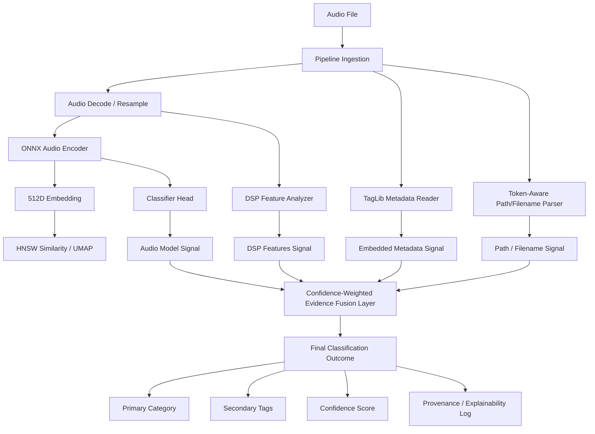

# NITE DSP SLO — Target Classification Architecture

This document describes the proposed target architecture for the Sample Library Optimiser (SLO) classification and metadata tagging engine.



---

## 1. Core Components

### 1.1 Audio Encoder & Classifier Head
Instead of discarding the classification layer of the neural network, the target model includes a lightweight multi-class classifier head trained on top of the 512D embeddings. This head outputs continuous probability logits for the canonical taxonomy categories (e.g. Kick, Snare, Pad, Bass).

### 1.2 Token-Aware Filename & Path Parser
Replaces naive substring contains checks with a tokenizing parser.
* Identifies boundary markers (underscores, spaces, camelCase, hyphens).
* Extracts structured tokens for BPM (`128bpm`, `140_bpm`), Key (`Fmin`, `C#_Maj`), and vendor names.
* Gated check: Ensures `kickstart.wav` is tokenized into `["kickstart"]` (no match) instead of matching `"kick"`.

### 1.3 Evidence Fusion Layer
Combines predictions from all signals with weights reflecting their reliability (provenance):
$$\text{Confidence}(C) = w_{\text{user}} P_{\text{user}}(C) + w_{\text{meta}} P_{\text{meta}}(C) + w_{\text{model}} P_{\text{model}}(C) + w_{\text{text}} P_{\text{text}}(C) + w_{\text{dsp}} P_{\text{dsp}}(C)$$

* **User Overrides** are absolute ($w_{\text{user}} = 1.0$, others $0.0$).
* **Embedded Metadata** has high priority.
* **Model vs. Filename**: A strong model prediction can override a weak or ambiguous filename (e.g., if a file is named `snare.wav` but features/embeddings are 99% confident it is a kick).

---

## 2. Explainability & Provenance Model
The engine stores a diagnostic record for each sample's classification to aid debugging and developer evaluations:

```json
{
  "filePath": "/Library/Kits/Snare_01.wav",
  "assignedCategory": "Drums",
  "assignedSubcategory": "Snare",
  "finalConfidence": 0.94,
  "provenance": {
    "userOverride": false,
    "signals": {
      "audioModel": { "class": "Snare", "confidence": 0.88 },
      "filename": { "class": "Snare", "confidence": 0.99 },
      "folderPath": { "class": "Drums", "confidence": 0.95 },
      "dspFeatures": { "class": "Percussion", "confidence": 0.82 }
    }
  }
}
```
